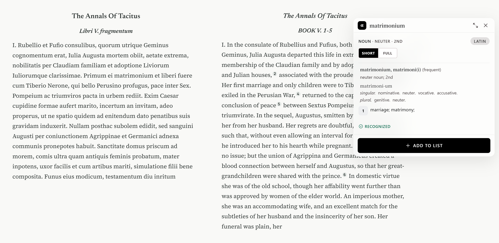
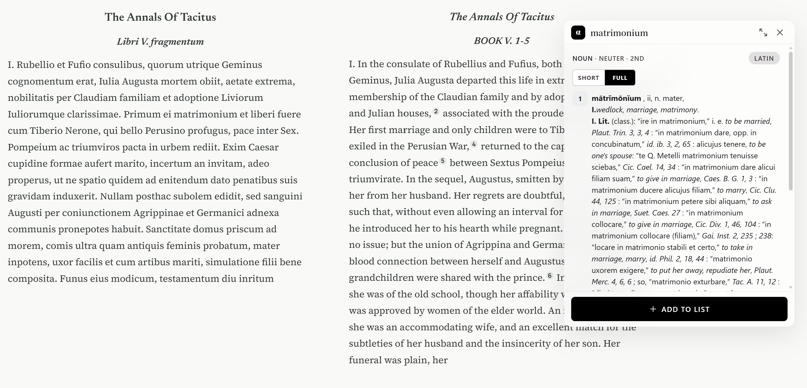
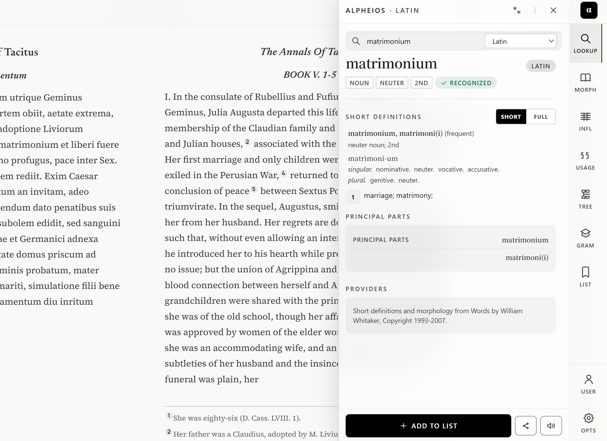

# Alpheios WebExtension

Browser extension for classical language reading tools (Chrome).

> **Status**: Under active development — not yet feature-complete. Community fork of [alpheios-project/webextension](https://github.com/alpheios-project/webextension).

## Screenshots

<p align="center">
  
  
  
</p>

## Build

Requires Node 20+ and a sibling checkout of [alpheios_alpheios-core](../alpheios_alpheios-core).

```bash
npm run install:dev-safe
npm run update-dist && npm run update-styles
npm run set-auth0            # no args = dev mode (no login required)
npm run build-dev
```

Load `dist/` as an unpacked extension:
- **Chrome**: `chrome://extensions` → Developer mode → Load unpacked

Production build:

```bash
npm run build
```

## Documentation

- [Build guide (Chrome/FF)](doc/guides/BUILD-FF-CHROME.md)
- [Build guide (Safari)](doc/guides/BUILD-SAFARI.md)
- [Development notes](doc/guides/DEVELOPMENT.md)
- [Full docs index](doc/README.md)
