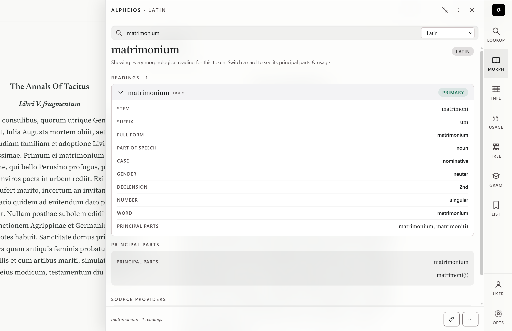
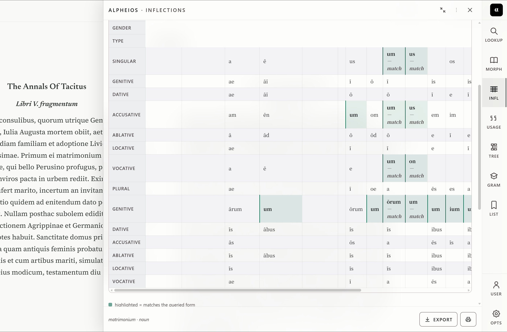

# Alpheios WebExtension

Browser extension for classical language reading tools (Chrome).

> **Status**: Under active development, not yet feature-complete.
>
> To use it, click the plugin icon in your browser, the popup will pop up automatically. Double-click any classical word on the page you'd like to look up, and it will return the result. If you run into issues where the popup won't open, try refreshing the page. As you might know, there are still a few bugs to fix. I can't promise a timeline, but I'll do what I can in my spare time.
>
> There's still a lot of work to be done, and it will take time... The 'Usage' and 'Tree' sections in the Drawer will be hidden. As for the 'Grammar' section, it may need to be rendered with different CSS?
>
> Account login is optional, because the sync feature isn't available yet. I only used my own account to test that Auth0 login works for now. So if you uninstall the plugin locally, be sure to export your saved words from the 'Word List' in time.


## Screenshots

Double-click a word to look it up in the popup


  


Look it up in the drawer






## Build

Requires Node 20+ and a sibling checkout of [alpheios_alpheios-core](https://github.com/heinsea/alpheios_alpheios-core).

```bash
npm run install:dev-safe
npm run update-dist && npm run update-styles
npm run set-auth0            # no args = dev mode (no login required)
npm run build-dev
```

Load `dist/` as an unpacked extension:
- **Chrome**: `chrome://extensions` → Developer mode → Load unpacked

Production build:

```bash
npm run build
```

## Documentation

- [Build guide (Chrome/FF)](doc/guides/BUILD-FF-CHROME.md)
- [Build guide (Safari)](doc/guides/BUILD-SAFARI.md)
- [Development notes](doc/guides/DEVELOPMENT.md)
- [Full docs index](doc/README.md)
